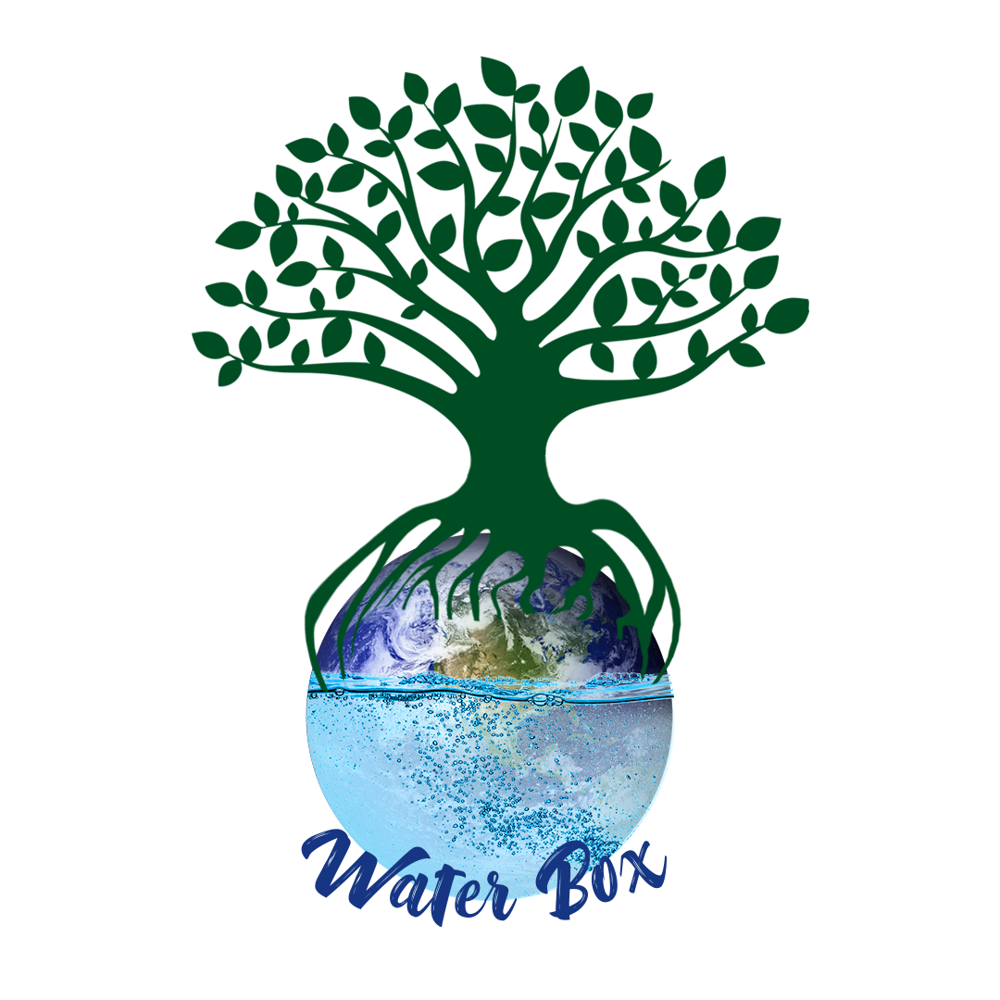
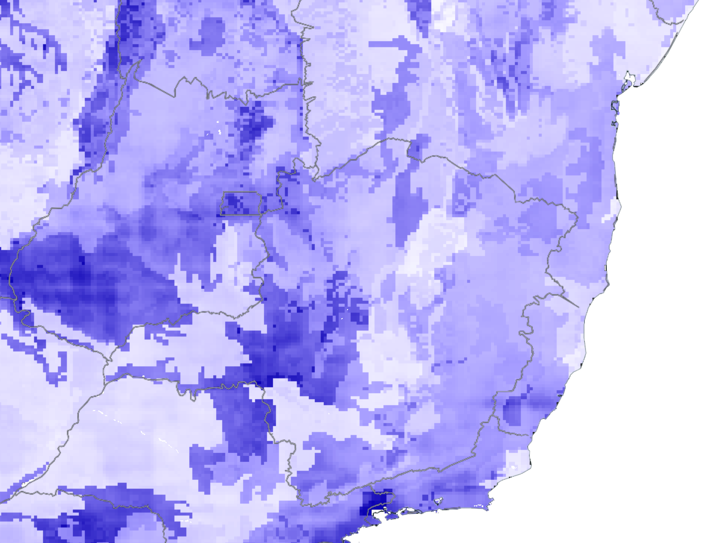

# Water Box

### What is the Earth Desertification Problem?

The desertification can be preliminarily understood as a set of phenomena that lead certain areas to become deserts or resemble them.

### What will our project provide?

We aim to provide a prioritization basis for promoting vegetation recovery and conservation actions, as well as optimizing processes such as water infiltration into the soil and promoting better storage and consequent water availability in the region.

#### How many simplified steps do we need to provide this?

1. Data Mining
2. Data Analysis
3. Data Correlation
4. Risk Areas Ranking
5. Finding Optimal Solution Implementation Area
6. Green Infrastructure Choosing

### Where has the dataset been found?

The links below contains the utilized datasets and those respective APIs:

* [Distributed Active Archive Center \(DAAC\) APIs](https://earthdata.nasa.gov/collaborate/open-data-services-and-software/api/daac-apis)
* [Albedo Index - MODIS Web Service](https://modis.ornl.gov/data/modis_webservice_soap.html)
* [Population Density Index - SEDAC REST services](https://sedac.ciesin.columbia.edu/arcgis/rest/services/sedac?_ga=2.68266456.87660087.1571488656-1154313842.1571488656)
* [Soil Moisture Index - NSIDC](https://nsidc.org/api?_ga=2.138969850.87660087.1571488656-1154313842.1571488656)

#### The datasets looks like these images below:

### How the data gathering and green infrastructures could be integrated in a unique solution?

The tool developed, talk about the technologies inside your project

