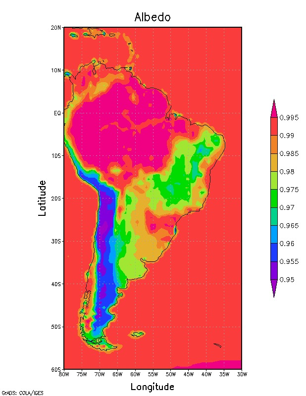
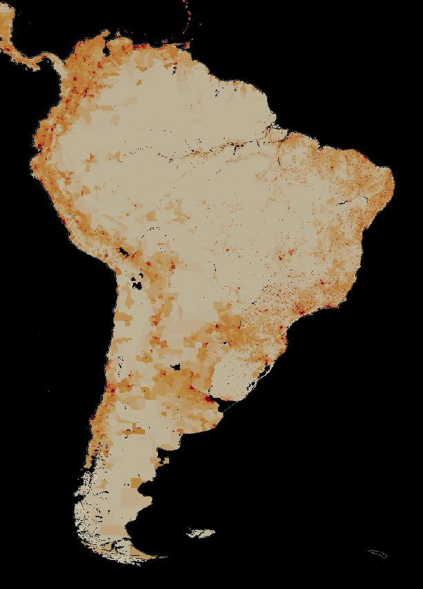

# GrADS Interface

### Albedo Index

```text
ga-> !ls
ga-> sdfopen MERRA2_400.tavgU_2d_rad_Nx.201908.nc4
Scanning self-describing file:  MERRA2_400.tavgU_2d_rad_Nx.201908.nc4
SDF file MERRA2_400.tavgU_2d_rad_Nx.201908.nc4 is open as file 1
LON set to 0 360
LAT set to -90 90
LEV set to 0 0
Time values set: 2019:8:1:0 2019:8:1:0
ga-> set t 2
Time values set: 2019:8:1:1 2019:8:1:1
ga-> set lon -60 20
LON set to -60 20
ga-> q file
File 1 : MERRA2 tavg1_2d_rad_Nx: 2d,1-Hourly,Time-Averaged,Single-Level,Assimilation,Radiation Diagnostics Diurnal Mean
  Descriptor: MERRA2_400.tavgU_2d_rad_Nx.201908.nc4
  Binary: MERRA2_400.tavgU_2d_rad_Nx.201908.nc4
  Type = Gridded
  Xsize = 576  Ysize = 361  Zsize = 1  Tsize = 24  Esize = 1
  Number of Variables = 36
     albedo  0  t,y,x  surface_albedo
     albnirdf  0  t,y,x  surface_albedo_for_near_infrared_diffuse
     albnirdr  0  t,y,x  surface_albedo_for_near_infrared_beam
     albvisdf  0  t,y,x  surface_albedo_for_visible_diffuse
     albvisdr  0  t,y,x  surface_albedo_for_visible_beam
     cldhgh  0  t,y,x  cloud_area_fraction_for_high_clouds
     cldlow  0  t,y,x  cloud_area_fraction_for_low_clouds
     cldmid  0  t,y,x  cloud_area_fraction_for_middle_clouds
     cldtot  0  t,y,x  total_cloud_area_fraction
     emis  0  t,y,x  surface_emissivity
     lwgab  0  t,y,x  surface_absorbed_longwave_radiation
     lwgabclr  0  t,y,x  surface_absorbed_longwave_radiation_assuming_clear_sky
     lwgabclrcln  0  t,y,x  surface_absorbed_longwave_radiation_assuming_clear_sky_and_no_aerosol
     lwgem  0  t,y,x  longwave_flux_emitted_from_surface
     lwgnt  0  t,y,x  surface_net_downward_longwave_flux
     lwgntclr  0  t,y,x  surface_net_downward_longwave_flux_assuming_clear_sky
     lwgntclrcln  0  t,y,x  surface_net_downward_longwave_flux_assuming_clear_sky_and_no_aerosol
     lwtup  0  t,y,x  upwelling_longwave_flux_at_toa
     lwtupclr  0  t,y,x  upwelling_longwave_flux_at_toa_assuming_clear_sky
     lwtupclrcln  0  t,y,x  upwelling_longwave_flux_at_toa_assuming_clear_sky_and_no_aerosol
     swgdn  0  t,y,x  surface_incoming_shortwave_flux
     swgdnclr  0  t,y,x  surface_incoming_shortwave_flux_assuming_clear_sky
     swgnt  0  t,y,x  surface_net_downward_shortwave_flux
     swgntcln  0  t,y,x  surface_net_downward_shortwave_flux_assuming_no_aerosol
     swgntclr  0  t,y,x  surface_net_downward_shortwave_flux_assuming_clear_sky
     swgntclrcln  0  t,y,x  surface_net_downward_shortwave_flux_assuming_clear_sky_and_no_aerosol
     swtdn  0  t,y,x  toa_incoming_shortwave_flux
     swtnt  0  t,y,x  toa_net_downward_shortwave_flux
     swtntcln  0  t,y,x  toa_net_downward_shortwave_flux_assuming_no_aerosol
     swtntclr  0  t,y,x  toa_net_downward_shortwave_flux_assuming_clear_sky
     swtntclrcln  0  t,y,x  toa_net_downward_shortwave_flux_assuming_clear_sky_and_no_aerosol
     tauhgh  0  t,y,x  in_cloud_optical_thickness_of_high_clouds(EXPORT)
     taulow  0  t,y,x  in_cloud_optical_thickness_of_low_clouds
     taumid  0  t,y,x  in_cloud_optical_thickness_of_middle_clouds
     tautot  0  t,y,x  in_cloud_optical_thickness_of_all_clouds
     ts  0  t,y,x  surface_skin_temperature
ga-> set lon -80 -30
LON set to -80 -30
ga-> set lat -60 20
LAT set to -60 20
ga-> set display color white
ga-> c
ga-> set grads off
ga-> d emis
Contouring: 0.95 to 0.995 interval 0.005
ga-> draw title Albedo
ga-> cbarn.gs
ga-> draw xlab Longitude
ga-> draw ylab Latitude
ga-> printim Albedo.gif white
ga-> !ls
Albedo.gif                             model.ctl
MERRA2_400.tavgU_2d_rad_Nx.201908.nc4  model.grb
ga-> !ls
Albedo.gif                             model.ctl
MERRA2_400.tavgU_2d_lnd_Nx.201908.nc4  model.gmp
MERRA2_400.tavgU_2d_rad_Nx.201908.nc4  model.grb
ga-> sdfopen MERRA2_400.tavgU_2d_lnd_Nx.201908.nc4
Scanning self-describing file:  MERRA2_400.tavgU_2d_lnd_Nx.201908.nc4
SDF file MERRA2_400.tavgU_2d_lnd_Nx.201908.nc4 is open as file 2
ga-> q file
File 1 : MERRA2 tavg1_2d_rad_Nx: 2d,1-Hourly,Time-Averaged,Single-Level,Assimilation,Radiation Diagnostics Diurnal Mean
  Descriptor: MERRA2_400.tavgU_2d_rad_Nx.201908.nc4
  Binary: MERRA2_400.tavgU_2d_rad_Nx.201908.nc4
  Type = Gridded
  Xsize = 576  Ysize = 361  Zsize = 1  Tsize = 24  Esize = 1
  Number of Variables = 36
     albedo  0  t,y,x  surface_albedo
     albnirdf  0  t,y,x  surface_albedo_for_near_infrared_diffuse
     albnirdr  0  t,y,x  surface_albedo_for_near_infrared_beam
     albvisdf  0  t,y,x  surface_albedo_for_visible_diffuse
     albvisdr  0  t,y,x  surface_albedo_for_visible_beam
     cldhgh  0  t,y,x  cloud_area_fraction_for_high_clouds
     cldlow  0  t,y,x  cloud_area_fraction_for_low_clouds
     cldmid  0  t,y,x  cloud_area_fraction_for_middle_clouds
     cldtot  0  t,y,x  total_cloud_area_fraction
     emis  0  t,y,x  surface_emissivity
     lwgab  0  t,y,x  surface_absorbed_longwave_radiation
     lwgabclr  0  t,y,x  surface_absorbed_longwave_radiation_assuming_clear_sky
     lwgabclrcln  0  t,y,x  surface_absorbed_longwave_radiation_assuming_clear_sky_and_no_aerosol
     lwgem  0  t,y,x  longwave_flux_emitted_from_surface
     lwgnt  0  t,y,x  surface_net_downward_longwave_flux
     lwgntclr  0  t,y,x  surface_net_downward_longwave_flux_assuming_clear_sky
     lwgntclrcln  0  t,y,x  surface_net_downward_longwave_flux_assuming_clear_sky_and_no_aerosol
     lwtup  0  t,y,x  upwelling_longwave_flux_at_toa
     lwtupclr  0  t,y,x  upwelling_longwave_flux_at_toa_assuming_clear_sky
     lwtupclrcln  0  t,y,x  upwelling_longwave_flux_at_toa_assuming_clear_sky_and_no_aerosol
     swgdn  0  t,y,x  surface_incoming_shortwave_flux
     swgdnclr  0  t,y,x  surface_incoming_shortwave_flux_assuming_clear_sky
     swgnt  0  t,y,x  surface_net_downward_shortwave_flux
     swgntcln  0  t,y,x  surface_net_downward_shortwave_flux_assuming_no_aerosol
     swgntclr  0  t,y,x  surface_net_downward_shortwave_flux_assuming_clear_sky
     swgntclrcln  0  t,y,x  surface_net_downward_shortwave_flux_assuming_clear_sky_and_no_aerosol
     swtdn  0  t,y,x  toa_incoming_shortwave_flux
     swtnt  0  t,y,x  toa_net_downward_shortwave_flux
     swtntcln  0  t,y,x  toa_net_downward_shortwave_flux_assuming_no_aerosol
     swtntclr  0  t,y,x  toa_net_downward_shortwave_flux_assuming_clear_sky
     swtntclrcln  0  t,y,x  toa_net_downward_shortwave_flux_assuming_clear_sky_and_no_aerosol
     tauhgh  0  t,y,x  in_cloud_optical_thickness_of_high_clouds(EXPORT)
     taulow  0  t,y,x  in_cloud_optical_thickness_of_low_clouds
     taumid  0  t,y,x  in_cloud_optical_thickness_of_middle_clouds
     tautot  0  t,y,x  in_cloud_optical_thickness_of_all_clouds
     ts  0  t,y,x  surface_skin_temperature
```

### Output:



### Population Density Index

```text
ga-> q file 2
File 2 : MERRA2 tavg1_2d_lnd_Nx: 2d,1-Hourly,Time-Averaged,Single-Level,Assimilation,Land Surface Diagnostics Diurnal Mean
  Descriptor: MERRA2_400.tavgU_2d_lnd_Nx.201908.nc4
  Binary: MERRA2_400.tavgU_2d_lnd_Nx.201908.nc4
  Type = Gridded
  Xsize = 576  Ysize = 361  Zsize = 1  Tsize = 24  Esize = 1
  Number of Variables = 50
     baseflow  0  t,y,x  baseflow_flux
     echange  0  t,y,x  rate_of_change_of_total_land_energy
     evland  0  t,y,x  Evaporation_land
     evpintr  0  t,y,x  interception_loss_energy_flux
     evpsbln  0  t,y,x  snow_ice_evaporation_energy_flux
     evpsoil  0  t,y,x  baresoil_evap_energy_flux
     evptrns  0  t,y,x  transpiration_energy_flux
     frsat  0  t,y,x  fractional_area_of_saturated_zone
     frsno  0  t,y,x  fractional_area_of_land_snowcover
     frunst  0  t,y,x  fractional_area_of_unsaturated_zone
     frwlt  0  t,y,x  fractional_area_of_wilting_zone
     ghland  0  t,y,x  Ground_heating_land
     grn  0  t,y,x  greeness_fraction
     gwetprof  0  t,y,x  ave_prof_soil_moisture
     gwetroot  0  t,y,x  root_zone_soil_wetness
     gwettop  0  t,y,x  surface_soil_wetness
     lai  0  t,y,x  leaf_area_index
     lhland  0  t,y,x  Latent_heat_flux_land
     lwland  0  t,y,x  Net_longwave_land
     pardfland  0  t,y,x  surface_downwelling_par_diffuse_flux
     pardrland  0  t,y,x  surface_downwelling_par_beam_flux
     precsnoland  0  t,y,x  snowfall_land
     prectotland  0  t,y,x  Total_precipitation_land
     prmc  0  t,y,x  water_profile
     qinfil  0  t,y,x  Soil_water_infiltration_rate
     runoff  0  t,y,x  overland_runoff_including_throughflow
     rzmc  0  t,y,x  water_root_zone
     sfmc  0  t,y,x  water_surface_layer
     shland  0  t,y,x  Sensible_heat_flux_land
     smland  0  t,y,x  Snowmelt_flux_land
     snodp  0  t,y,x  snow_depth
     snomas  0  t,y,x  Total_snow_storage_land
     spland  0  t,y,x  rate_of_spurious_land_energy_source
     spsnow  0  t,y,x  rate_of_spurious_snow_energy
     spwatr  0  t,y,x  rate_of_spurious_land_water_source
     swland  0  t,y,x  Net_shortwave_land
     teland  0  t,y,x  Total_energy_storage_land
     tpsnow  0  t,y,x  surface_temperature_of_snow
     tsat  0  t,y,x  surface_temperature_of_saturated_zone
     tsoil1  0  t,y,x  soil_temperatures_layer_1
     tsoil2  0  t,y,x  soil_temperatures_layer_2
     tsoil3  0  t,y,x  soil_temperatures_layer_3
     tsoil4  0  t,y,x  soil_temperatures_layer_4
     tsoil5  0  t,y,x  soil_temperatures_layer_5
     tsoil6  0  t,y,x  soil_temperatures_layer_6
     tsurf  0  t,y,x  surface_temperature_of_land_incl_snow
     tunst  0  t,y,x  surface_temperature_of_unsaturated_zone
     twland  0  t,y,x  Avail_water_storage_land
     twlt  0  t,y,x  surface_temperature_of_wilted_zone
     wchange  0  t,y,x  rate_of_change_of_total_land_water
ga-> d grn.2
Contouring: 0 to 0.9 interval 0.1
ga-> c
ga-> d grn.2
Contouring: 0 to 0.9 interval 0.1
ga-> cbarn.gs
ga-> c
ga-> d qinfil.2
Contouring: 0 to 9e-05 interval 1e-05
ga-> cbarn.gs
ga-> draw xlab Longitude
ga-> draw ylab Latitude
ga-> draw title Taxa de Infiltracao de agua no Solo
ga-> printim taxainfiltaguasolo.gif white
ga-> c
ga-> d twland.2
Contouring: 200 to 2000 interval 200
ga-> cbarn.gs
ga-> draw ylab Latitude
ga-> draw xlab Longitude
ga-> draw title Disponibilidade de Solo Armazenador de Agua
ga-> printim diponibsoloarmazenador.gif white
```

### Output:




